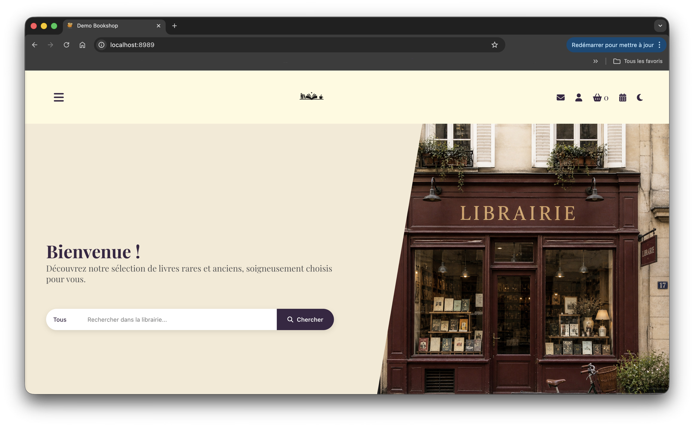

# ABStock Bookstore Demo

## Présentation

**ABStock Extended Demo** est une version **largement modifiée, étendue et personnalisée** du projet open source **ABStock**, initialement développé en Common Lisp.

Projet d’origine :
https://github.com/vindarel/ABStock

Cette version a été réalisée dans le cadre d’un **besoin concret de librairie indépendante**, puis **neutralisée** afin d’être publiée comme démonstration technique et portfolio public.

Elle illustre un travail de :

* développement backend,
* architecture applicative,
* templating frontend,
* intégration de services externes,
* UX/UI,
* adaptation métier,
* personnalisation fonctionnelle.

Cette publication **ne contient aucune donnée de production** :

* aucune base commerciale réelle,
* aucune donnée client,
* aucun historique de commandes,
* aucune clé API active,
* aucune configuration sensible.

---

# Philosophie du projet

L’objectif n’était pas de produire une simple vitrine, mais une **application web exploitable**, pensée comme base logicielle pour une librairie moderne :

* consultation catalogue,
* recherche,
* navigation éditoriale,
* panier,
* tunnel de commande,
* authentification,
* espace utilisateur,
* paiement,
* livraison,
* administration,
* extensibilité métier.

Le projet conserve la robustesse de la base ABStock tout en y ajoutant une couche fonctionnelle et UX beaucoup plus complète.

---

# Fonctionnalités développées / adaptées

## 1) Catalogue de livres

Gestion d’un catalogue structuré :

* affichage des ouvrages,
* fiches détaillées,
* auteurs,
* éditeurs,
* distributeurs,
* ISBN,
* couverture,
* métadonnées,
* état / disponibilité,
* présentation claire des ouvrages.

Le catalogue est pensé pour rester exploitable aussi bien comme :

* boutique,
* catalogue public,
* outil interne.

---

## 2) Recherche & navigation

Travail sur la consultation :

* moteur de recherche,
* navigation catalogue,
* listing lisible,
* présentation responsive,
* cartes produit,
* consultation détaillée.

Objectif :
**réduire la friction utilisateur**.

---

## 3) Authentification & espace utilisateur

Implémentation / adaptation :

* inscription,
* connexion,
* déconnexion,
* session utilisateur,
* profil,
* modification informations,
* changement mot de passe,
* sécurité basique côté session.

Templates dédiés :

* connexion,
* inscription,
* changement mot de passe,
* compte.

---

## 4) Panier dynamique

Développement d’un tunnel panier complet :

* ajout article,
* suppression,
* modification quantités,
* persistance session,
* calcul total,
* affichage détaillé,
* préparation checkout.

---

## 5) Tunnel de commande complet

Mise en place d’un workflow :

### Adresse

* nom,
* prénom,
* téléphone,
* email,
* adresse,
* ville,
* code postal,
* pays.

### Livraison

* choix mode livraison,
* sélection relais,
* intégration Colissimo.

### Paiement

* intégration flux de paiement.

### Validation

* confirmation finale.

---

## 6) Intégration Colissimo

Développement d’un proxy dédié :

* serveur proxy Node,
* récupération token widget,
* intégration widget relais,
* sélection point relais,
* communication front/back,
* sérialisation des données de livraison.

Cela montre :

* intégration API,
* proxy sécurisé,
* orchestration frontend/backend.

---

## 7) Intégration paiement (Stancer)

Mise en place d’un proxy de paiement :

* encapsulation API,
* gestion secret côté backend,
* création session paiement,
* redirection utilisateur,
* retour paiement,
* récupération statut.

Implémentations présentes :

* Node
* Python
* Lisp

Objectif :
montrer plusieurs approches d’intégration backend.

---

## 8) Frontend / UI

Travail important sur :

* pages,
* composants,
* styles,
* responsive,
* dark mode,
* formulaires,
* feedback utilisateur,
* cohérence visuelle.

Stack :

* HTML
* CSS
* JavaScript
* Bulma

Templates fortement personnalisés.

---

## 9) Architecture Common Lisp

Backend basé sur :

* Common Lisp
* Hunchentoot
* Djula
* SQLite
* modules Lisp séparés
* configuration centralisée
* templates compilés
* handlers dédiés

Présence de :

* logique métier,
* routes,
* auth,
* panier,
* checkout,
* paiement,
* livraison,
* utilitaires,
* config.

---

## 10) Administration

Fonctionnalités internes :

* admin route,
* édition contenu,
* configuration,
* gestion interne.

---

# Ce projet montre

Compétences mobilisées :

## Backend

* architecture serveur,
* logique métier,
* persistance,
* sécurité basique,
* APIs.

## Frontend

* templating,
* JS interactif,
* UX.

## Intégration

* paiement,
* livraison,
* proxy backend.

## Produit

* adaptation à un besoin réel.

---

# Captures d’écran

## Accueil

## Catalogue

## Fiche produit

## Checkout

---

# Origine du projet

Projet construit **à partir d’ABStock**, logiciel libre :

https://github.com/vindarel/ABStock

Puis :

* adapté,
* modifié,
* étendu,
* personnalisé.

---

# Licence

Projet original : GNU AGPL v3

Cette version dérivée conserve la compatibilité avec cette licence.
