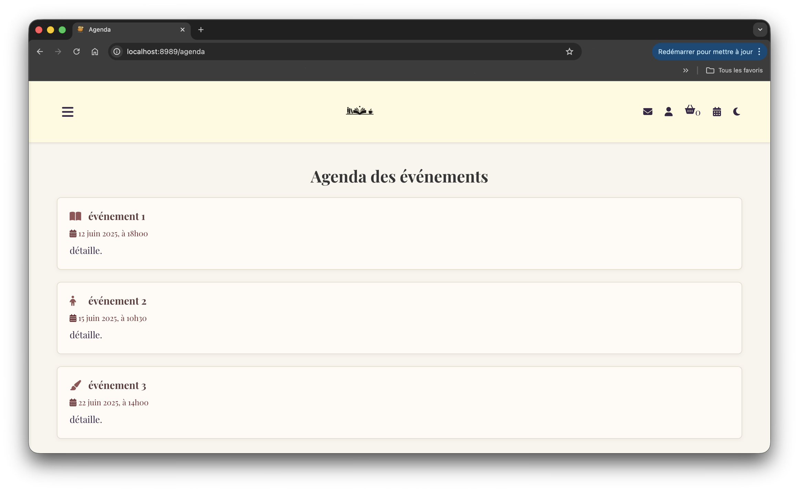
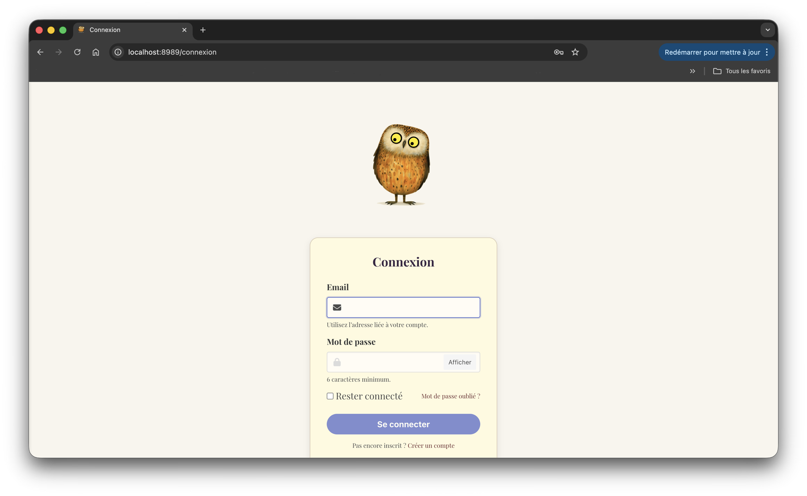
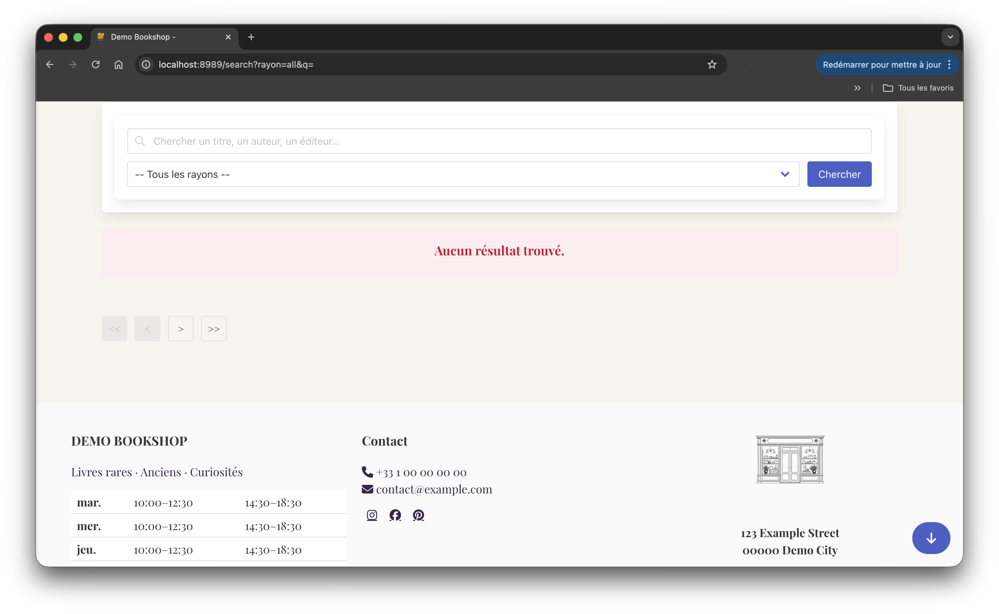

# ABStock Bookstore Demo

## Présentation

**ABStock Extended Demo** est une version largement modifiée, étendue et personnalisée du projet open source **ABStock**, initialement développé en Common Lisp.

Projet d’origine :  
https://github.com/vindarel/ABStock

Cette version a été réalisée dans le cadre d’un besoin concret de librairie indépendante, puis neutralisée afin d’être publiée comme démonstration technique et portfolio public.

Elle illustre un travail de :

- développement backend
- architecture applicative
- templating frontend
- intégration de services externes
- UX/UI
- adaptation métier
- personnalisation fonctionnelle

Cette publication ne contient aucune donnée de production :

- aucune base commerciale réelle
- aucune donnée client
- aucun historique de commandes
- aucune clé API active
- aucune configuration sensible

---

## Stack technique

Le projet repose sur un environnement Common Lisp structuré autour des composants suivants :

- Backend : Common Lisp (SBCL)
- Serveur HTTP & Routing : Hunchentoot
- Templating : Djula (rendu HTML dynamique côté serveur)
- Frontend :
  - HTML5 / CSS3
  - JavaScript
  - Framework CSS : Bulma
- Base de données (version originale) : SQLite
- Proxies externes :
  - Node.js (Express) pour Colissimo
  - Node.js / Python / Lisp pour Stancer (approches multiples)

Le projet est basé sur ABStock mais étendu avec des fonctionnalités supplémentaires et une architecture enrichie.

---

## Architecture du projet

L’application suit une architecture web backend modulaire.

### Models

Les entités métier (livres, commandes, utilisateurs) sont représentées sous forme de structures Lisp.

- Version originale : persistance SQLite
- Version démo : données simulées ou absentes

---

### Views (Templates)

Le rendu HTML est géré avec Djula :

- séparation logique / présentation
- templates réutilisables
- rendu côté serveur
- personnalisation du thème

---

### Routing & contrôleurs

Les routes HTTP sont définies côté backend :

- catalogue
- panier
- authentification
- checkout
- paiement
- livraison

Chaque route encapsule une logique métier spécifique.

---

### Proxy logic

Le projet intègre une couche proxy pour interfacer des services externes.

#### Colissimo

- récupération de token widget
- affichage des points relais
- sélection utilisateur
- communication frontend / backend

#### Stancer (paiement)

- encapsulation API
- gestion des secrets côté backend
- création de session de paiement
- redirection utilisateur
- gestion du retour et du statut

Objectif : isoler les appels API externes et sécuriser les credentials.

---

## Note importante (version démo)

Cette version est une démonstration technique.

La base de données réelle a été supprimée pour des raisons de confidentialité.

- aucune donnée client incluse
- aucun historique réel
- aucun contenu commercial exploitable

Le projet reste fonctionnel sur le plan technique mais sert principalement à illustrer :

- l’architecture backend
- l’intégration de services externes
- la logique métier d’une librairie

---

## Objectif du projet

Ce projet a été réalisé pour répondre à un besoin réel.

Objectif :

Concevoir un système de gestion de librairie modulaire, extensible et performant en exploitant les capacités de Common Lisp (macros, flexibilité, abstraction).

Il a ensuite été adapté en version publique pour démontrer :

- des compétences backend solides
- une capacité à intégrer des services externes
- une réflexion produit complète

---

## Philosophie du projet

L’objectif n’était pas de produire une simple vitrine, mais une application web exploitable, pensée comme base logicielle pour une librairie moderne :

- consultation catalogue
- recherche
- navigation éditoriale
- panier
- tunnel de commande
- authentification
- espace utilisateur
- paiement
- livraison
- administration
- extensibilité métier

---

## Fonctionnalités développées / adaptées

### 1) Catalogue de livres

- affichage des ouvrages
- fiches détaillées
- auteurs / éditeurs
- ISBN
- couverture
- disponibilité

---

### 2) Recherche & navigation

- moteur de recherche
- navigation fluide
- responsive
- consultation détaillée

Objectif : réduire la friction utilisateur.

---

### 3) Authentification & espace utilisateur

- inscription
- connexion / déconnexion
- session utilisateur
- profil
- modification des informations
- changement de mot de passe

---

### 4) Panier dynamique

- ajout / suppression
- modification des quantités
- persistance session
- calcul du total

---

### 5) Tunnel de commande

#### Adresse

- informations utilisateur complètes

#### Livraison

- choix du mode de livraison
- sélection relais Colissimo

#### Paiement

- intégration Stancer

#### Validation

- confirmation finale

---

### 6) Intégration Colissimo

- proxy Node
- widget officiel
- sélection point relais
- communication frontend / backend

---

### 7) Intégration paiement (Stancer)

- proxy sécurisé
- création de session
- redirection
- retour paiement
- récupération du statut

Implémentations présentes :

- Node
- Python
- Lisp

---

### 8) Frontend / UI

- pages complètes
- responsive
- dark mode
- formulaires
- cohérence visuelle

Stack :

- HTML
- CSS
- JavaScript
- Bulma

### Expérience d’authentification interactive

Implémentation d’une mascotte interactive (hibou) sur les pages de connexion :

- suivi dynamique du curseur via JavaScript
- réaction visuelle lors de la saisie du mot de passe
- animation de confidentialité (la mascotte se couvre les yeux)

Objectif :
Améliorer l’engagement utilisateur et apporter une dimension plus intuitive et ludique à l’expérience d’authentification.

---

### 9) Backend Common Lisp

- Hunchentoot
- Djula
- modules séparés
- configuration centralisée
- logique métier complète

---

### 10) Administration

- route admin
- édition de contenu
- configuration

---

## Ce projet montre

### Backend

- architecture serveur
- logique métier
- APIs

### Frontend

- templating
- interactions JavaScript
- UX

### Intégration

- paiement
- livraison
- proxies backend

### Produit

- adaptation à un besoin réel

---

## Captures d’écran

### Accueil

### Catalogue

### Connexion

### Produits

---

## Origine du projet

Projet construit à partir d’ABStock :

https://github.com/vindarel/ABStock

Puis :

- adapté
- modifié
- étendu
- personnalisé

---

## Contexte

Projet réalisé pour un client réel (librairie), puis adapté en version publique pour démonstration technique et portfolio.

---

## Licence

Projet original : GNU AGPL v3

Cette version dérivée conserve la compatibilité avec cette licence.
